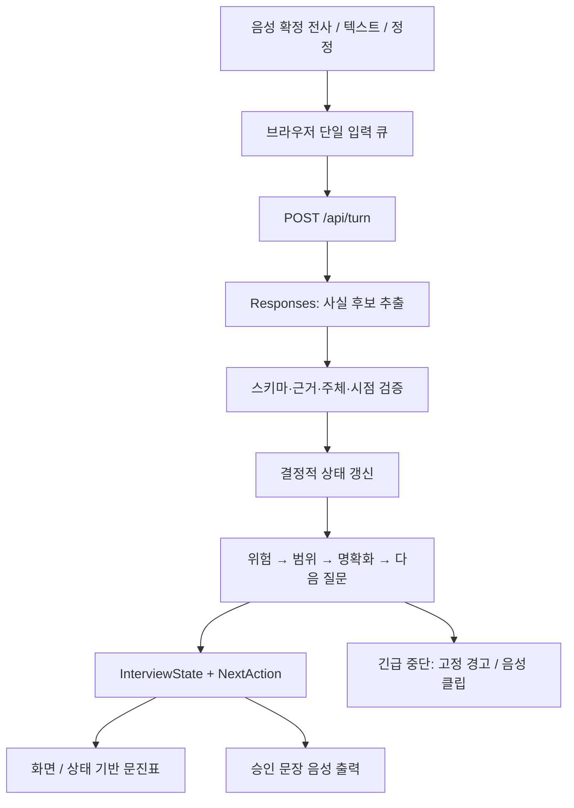

# CareFrame 프로젝트 설계

작성일: 2026-10-09 · 설계 v1.1 제안 · 앱 구현/실행 검증 전

## 1. 목표와 현재 상태

CareFrame의 첫 결과물은 **영희와 증상을 이야기하고, 원문 근거와 미확인 정보가 남는 진료 준비 자료를 인쇄하는 데모**다. 성공 기준은 기능 수가 아니라 실제 음성 입력부터 인쇄까지 이어지는 한 흐름이다.

현재 작업 폴더에는 `CareFrame_Codex_Handoff_v1/`의 9개 문서와 ZIP이 있으며 실행 소스, 패키지 설정, Git 저장소는 없다. 기존 문서는 보존하고 이 문서에서 구현 결정을 보완한다. ZIP은 이번 설계의 근거로 사용하지 않았다.

명명 제안: CareFrame은 프로젝트/제품 이름, 영희는 사용자와 대화하는 AI 페르소나다. 기존 handoff의 제출용 이름은 유지할 수 있다. 병원 운영 전체로 범위를 확대하지 않는다.

이번 작업은 설계까지다. 문서 속 `CODEX_FIRST_PROMPT.md`는 구현 시 사용할 자료이며 이번 사용자 요청을 구현 지시로 바꾸지 않는다.

## 2. 고정 범위

| 항목 | 첫 버전 |
|---|---|
| 대상 | 가상 증례를 연기하는 성인, 자신의 상복부/명치 불편감 |
| 대화 | 한국어, 영희 1명, 한 번에 질문 1개 |
| 입력 | 음성, 텍스트, 전사 정정 |
| 처리 | 근거 있는 사실 추출, 고정 질문 순서, 설정된 위험 신호 중단 |
| 결과 | 확인 가능한 병력 자료, 미확인 정보, A4 인쇄 |
| 저장 | 브라우저 메모리만, 새로고침 시 삭제 |
| 제외 | 진단/처방, 로그인/DB, 가족 계정, EMR, RAG, 복수 증상 경로 |

공식 CPX 전체 구현이나 임상 검증을 주장하지 않는다. 기존 임상 프로토콜과 안내 문구는 검토 미완료 상태를 유지한다. 일반 임상 서비스로의 공개는 별도 단계다.

## 3. 화면 설계

### 시작

제품 표시 `CareFrame · 영희`, AI 고지, 지원 범위, 가상 정보 전용 안내와 필수 동의 체크를 둔다. 중심 버튼은 ‘대화 시작’. 마이크 권한 거절이나 음성 장애 시 ‘글로 이야기하기’를 제공한다. 연결 상태는 실제 이벤트로 표시한다.

### 대화

큰 글씨의 현재 질문과 음성 상태를 먼저 보여준다. 옆에는 ‘지금까지 들은 내용’과 ‘아직 확인하지 못한 내용’을 둔다. 각 사실에 원문 버튼과 전사 확인 여부를 붙인다. 모바일에서는 질문, 입력, 기록 순서로 세로 배치한다.

하단 기능은 마이크 일시정지, 텍스트 답변, 지금까지 정리, 종료다. 전사는 수정 가능한 자동 전사로 표시한다. 정정은 별도 입력으로 처리하고 원문은 유지한다. 사실값을 직접 편집해서 근거 없이 바꾸지 않는다.

### 확인 및 인쇄

수집 내용과 정정 이력을 확인한 뒤 해당 revision을 확인 상태로 기록한다. 확인 이후 정정하면 확인 상태를 해제한다. 미완료 상태에서도 인쇄할 수 있지만 미확인 항목과 중단 이유를 분명히 표시한다.

### 긴급 중단

현재 질문보다 경고를 먼저 표시하고 일반 출력/대기열을 취소한다. 고정 안내 음성 실패에도 화면 안내는 유지한다. 119 번호와 행동 문구는 클릭 없이 읽을 수 있어야 한다. 같은 세션에서 경고는 해제되지 않는다. 인쇄는 이후 선택 기능이다.

본문 18px 이상, 질문 약 24px, 높은 대비, 키보드 조작과 실제 상태 변경 알림을 기본으로 한다. 캐릭터 이미지나 가짜 진행률은 필요하지 않다.

## 4. 구조와 책임



Next.js App Router + TypeScript의 단일 앱, Zod 입력 검증, Vitest를 사용한다. 별도 백엔드나 데이터 저장소를 추가하지 않는다. 패키지 버전은 구현 시 호환성을 확인하고 lockfile로 고정한다.

| 모듈 | 책임 | 허용하지 않는 책임 |
|---|---|---|
| `extract.ts` | 최신 사용자 발언에서 FactCandidate 추출 | 다음 질문/행동 결정, 전체 상태 재작성 |
| `validate-evidence.ts` | 필드, 사용자 turn, 정확한 인용, 질문 연결 검증 | 원문 일치만으로 사실 정확성 보증 |
| `reducer.ts` | 사실 반영, 정정 이력, revision, 확인 무효화 | 외부 API 호출, UI 상태 변경 |
| `safety.ts` | 검토된 규칙과 근거로 SafetyState 계산 | 진단/질환 확률, 안전 보증 |
| `select-next-question.ts` | 미확인 항목과 질문 이력으로 고정 질문 선택 | 자유 생성 질문 |
| `controller.ts` | 음성 연결, 입력 순서, 중복, 끼어들기, 재생 취소 | 임상 상태의 별도 사본 유지 |
| `build-report.ts` | 현재 상태에서 문진표 모델 생성 | 마지막 LLM 요약, 사실 추가 |

순수 함수로 임상 상태를 처리하고 API와 음성을 바깥에 둔다. 입력 경로가 바뀌어도 같은 엔진을 사용한다.

## 5. 상태와 전이

`InterviewState`만 문진 사실의 기준이다. 전사, facts, 정정 이력, 질문 이력, safety, completion은 handoff 계약을 따른다. 음성 연결/녹음/재생/처리 중 같은 임시 UI 상태는 별도로 관리하며 임상 사실에 섞지 않는다.

| 이벤트 | 결과 |
|---|---|
| 동의 및 시작 | ready → interviewing, 고정 첫 질문 |
| answer | 검증된 facts 갱신, 다음 행동 선택 |
| correct | 기존 근거 무효화/이력 보존, 대체 근거 반영, 확인 상태 해제 |
| end / 시간·턴 상한 | 입력 정리 후 review, 필수 정보 미확인이면 partial |
| confirm | 확인한 revision 기록, finished |
| 위험 규칙 발동 | 어느 상태에서도 urgent_stop, latched=true |
| 범위 밖 | 위험 평가 이후 out_of_scope, 확보된 정보만 표시 |
| API 오류 | 기존 facts 유지, error_paused와 명시적 재시도 |

urgent_stop에서 correct/end/confirm이 와도 경고를 유지한다. ‘설정된 규칙 미발동’과 ‘의학적으로 안전함’을 구분한다.

`complete`는 문진표 수집 절차의 완료만 의미한다. 안전 평가 완료를 뜻하지 않는다. 필수 필드의 not_assessed/unclear/unknown/declined가 남으면 기본은 partial로 둔다. 불명확한 위험 항목은 일반 완료 안내 대신 기존 한계 안내로 종료한다.

## 6. handoff에서 구체화할 계약

아래는 v1.1 구현 제안이며 원문 v1.0에 조용히 덮어쓰지 않는다. 실제 구현 전 관련 타입/API 계약에 함께 반영한다.

### 6.1 정정은 단순 덮어쓰기가 아니다

한 발언이 여러 사실의 근거가 될 수 있다. `target_turn_id`를 정정할 때 그 turn에 의존하는 활성 근거를 모두 제거하고 이전 facts를 이력으로 남긴다. 다른 유효 근거가 없어진 항목은 not_assessed로 돌린다. 여러 근거로 유지되는 항목은 유효한 근거만 남겨 재계산한다.

정정 UI는 대체 발언 전체를 제출한다. 예: ‘사흘 전부터 명치가 쓰려요’의 시작 시점을 바꾸면 전체 대체 문장을 보여주고 제출한다. 일부분만 ‘일주일’이라고 보내서 위치·양상이 사라지는 문제를 피한다. 대체 발언은 현재 질문에 대한 답변으로 연결하지 않는다.

새 발언이 기존 사실과 충돌하되 정정 대상이 분명하지 않으면 최신 값으로 몰래 덮어쓰지 않는다. 원문을 보존하고 1회 명확화한다. 유효 근거가 있는 명확한 위험 신호는 이 충돌 확인보다 먼저 평가한다.

### 6.2 질문 발행과 실제 전달을 구분한다

`asked_question_ids`는 중복 선택 방지를 위한 발행 이력이다. 별도로 질문 ID, 표시 revision, 음성 재생 완료/중단을 기록하는 전달 이력을 둔다.

발언이 시작될 때 화면에 있던 질문 ID를 입력에 고정한다. 처리 완료 시점의 `last_question_id`를 뒤늦게 붙이지 않는다. 질문 음성이 끊겼거나 더 오래된 발언이 뒤늦게 도착하면 ‘아니요’를 자동으로 부정 소견에 연결하지 않는다. 명시적인 텍스트 질문 응답 등 연결이 분명한 경우에만 적용한다.

### 6.3 타인의 현재 위험 신호

handoff는 타인의 facts를 본인 병력에 병합하지 않으면서 현재 타인 위험을 우선할 수 있다고 한다. 타인/과거/불명확 주체의 후보를 별도 contextual evidence로 보존한다. 검토된 규칙이 명확한 현재 타인 위험을 지원하는 경우 도움 안내를 우선하되, 그 근거는 본인 facts에 넣지 않는다. 이 처리와 고정 문구는 임상 검토 항목으로 남긴다.

### 6.4 종료 직전 발언

종료를 누르면 새 녹음을 막고 이미 들어온 확정 전사와 진행 중인 요청을 먼저 처리한다. 아직 확정되지 않은 음성은 정해진 제한 시간만 기다린다. 실패하면 누락 가능성을 알리고 기존 정보로 partial report를 만든다. 발언이 처리됐다고 가정하지 않는다.

### 6.5 순서·재시도

한 번에 /api/turn 1개만 실행한다. provider item ID로 중복을 막고 이전 항목 연결로 순서를 복원한다. 선행 항목 누락 시 새 질문 음성을 보류하고 짧게 기다린 후 오류/텍스트 확인으로 전환한다. 도착 순서만으로 임상 발언 순서를 정하지 않는다.

request_id와 session_id, base_revision, 음성 generation을 확인한 응답만 적용한다. 취소/새 세션/정정 후의 오래된 응답은 버린다. 재시도는 성공 응답 미적용 상태에서 같은 입력 ID로 명시적으로 실행한다. 서버의 stateless 중복 확인은 유료 호출의 전역 중복 방지를 보장하지 않는다.

### 6.6 12턴과 필수 질문

기본 문진 7개와 위험 항목 6개를 모두 개별 질문하면 첫 질문을 포함해 13개다. 12턴 상한에서 자발적 정보가 부족한 사용자에게 완전 수집을 보장할 수 없다. 질문을 묶거나 미질문을 부정으로 처리하지 않고 partial로 종료한다. T01의 완료 흐름은 자발적 다항목 발언으로 필요한 질문 수가 줄어드는 조건이다.

정정·confirm·end는 일반 답변 수에 포함하지 않되 별도 전체 이벤트 수/입력 크기 제한을 둔다. 안전 관련 확인을 상한 뒤에 끝없이 이어가지 않는다.

## 7. 음성 전략과 공식 문서 확인

Plan A는 handoff대로 RealtimeSession/WebRTC로 시작한다. 자동 응답을 막고 서버가 승인한 문장만 발화 요청한다. 음성 출력은 모델이 바꿀 가능성이 있어 실제 출력 전사도 확인한다. 긴급 안내는 고정 클립으로 분리한다.

**구현 전 확인해야 할 차이:** `gpt-live-transcribe`의 전사용 세션은 turn detection을 null/생략해야 하며 server/semantic VAD를 지원하지 않는다. handoff의 ‘VAD 사용’ 설정을 전사용 세션에 그대로 복사할 수 없다. 이것만으로 Realtime 대화 세션 내 입력 전사와의 호환 여부를 확정할 수는 없다. 설치 SDK 타입, Realtime session 계약, 실제 3턴 시험으로 조합을 결정한다. [공식 전사 문서](https://developers.openai.com/api/docs/guides/realtime-transcription), [VAD 문서](https://developers.openai.com/api/docs/guides/realtime-vad).

`gpt-realtime-2.1`은 공식 문서상 Structured Outputs 미지원이므로 음성 모델의 응답을 엄격한 사실 계약으로 사용하지 않는다. 추출은 별도 Responses API로 처리한다. [모델 문서](https://developers.openai.com/api/docs/models/gpt-realtime-2.1).

Structured Outputs는 형식 제약이며 의미 검증을 대체하지 않는다. 스키마 파싱 뒤 원문·부정 범위·주체·시점 검증을 한다. [구조화 출력 문서](https://developers.openai.com/api/docs/guides/structured-outputs).

후보 모델은 handoff의 환경변수로 유지한다. 계정 접근·가격·한국어 성능·설치 SDK 호환성은 미확인이다. 모델명을 추측하거나 설계 단계에서 성공으로 기록하지 않는다.

60분 내 3턴, 확정 전사, 자동응답 억제, 끼어들기, 마이크 종료가 통과하지 않으면 Plan B로 전환한다. Plan B는 녹음→파일 전사→동일 엔진→승인 텍스트 TTS다. 이때만 `/api/transcribe`, `/api/speak`를 추가한다. 두 음성 경로를 병렬로 완성하지 않는다.

## 8. API·보안·실패 처리

기본 endpoint는 `/api/realtime-token`, `/api/turn`, `/api/health` 3개다. 세부 계약은 원문 [DATA_CONTRACTS.md](../CareFrame_Codex_Handoff_v1/planning/DATA_CONTRACTS.md)를 기준으로 한다.

서버는 전달 상태를 검증하지만 중앙 세션 기록을 보관하지 않는다. revision은 일관성 검사이며 인증/신뢰 경계가 아니다. 사용자가 상태를 변조할 수 있는 데모 구조를 일반 임상 서비스의 보안 구조로 설명하지 않는다.

입력 바이트·문자열·turn 수·배열 수를 제한하고 허용 필드를 고정한다. 같은 출처 요청, no-store, 서버 전용 일반 API 키, 브라우저 단기 토큰을 적용한다. raw 음성/전사/토큰 로그와 tracing은 비활성화한다. 서버 오류에는 요청 ID·오류 코드·경과 시간만 남긴다.

Responses `store=false`와 앱의 무저장은 공급자 측 보존이 전혀 없다는 뜻이 아니다. 사용자 고지에 둘을 분리한다. [데이터 제어 문서](https://developers.openai.com/api/docs/guides/your-data).

8초에는 처리 안내, 15초에는 timeout과 취소를 제공한다. 형식 오류 보정은 1회 이내이며 429/권한 오류는 명시적으로 중단한다. API 실패를 fixture 성공으로 대체하지 않는다. 8분 세션 상한, 90초 무응답 일시정지, 종료/이탈의 마이크 해제를 구현한다.

공개 데모 전에 호스팅의 접근·요청 제한과 API 프로젝트 예산을 확인한다. 앱 내부 제한만으로 서버 유료 호출 남용이 해결됐다고 판단하지 않는다.

## 9. 제안 디렉터리

앱 구현 시 루트에 단일 Next.js 앱을 둔다. 현재 handoff 폴더는 그대로 남긴다.

```text
app/
  page.tsx
  api/{health,realtime-token,turn}/route.ts
components/
  StartView.tsx  InterviewView.tsx  UrgentView.tsx
  VoicePanel.tsx  HistoryPanel.tsx  ReportView.tsx
lib/
  contracts.ts
  interview/{extract,validate-evidence,reducer,safety,select-next-question}.ts
  voice/{controller,turn-queue}.ts
  report/build-report.ts
data/protocol.ts
tests/{interview,voice,report}/
evaluation/
public/audio/
planning/PROJECT_DESIGN.md
tasks/{todo,lessons}.md
CareFrame_Codex_Handoff_v1/  # 전달받은 원문 보존
README.md  PROGRESS.md  PREWORK.md  THIRD_PARTY_NOTICES.md
```

protocol.ts에 필드·질문·규칙·버전을 모은다. 후보 스키마, 질문 선택, 문진표 제목은 이 사전을 참조해 항목 간 불일치를 줄인다. 문진표는 React의 문자열 렌더링을 사용하고 사용자 입력을 HTML로 실행하지 않는다.

## 10. 구현 순서와 완료 게이트

| 단계 | 결과물 | 실제 통과 기준 |
|---|---|---|
| M0 환경 | 행사 저장소 확인, 버전/설정, 실행 뼈대 | 로컬 시작, health, 모델 접근 결과 기록 |
| M1 음성 실험 | 단일 화면 음성 연결 | 한국어 3턴, final 전사, 응답 제어, 끼어들기, 마이크 종료 |
| M2 엔진 | 텍스트 입력부터 문진표까지 | T02/T03/T05/T09 우선, 근거/정정/부정 분리 |
| M3 통합 | 음성→엔진→질문→원문/인쇄 | 실제 입력이 상태와 출력에 반영, 오류/중단 포함 |
| M4 동결·회귀 | 12개 API 증례와 순수 함수 테스트 | 기대값 선고정, 실행 결과/실패/미실행 구분 |
| M5 데모·제출 | 음성 V01~V03, 녹화, 문서, 링크 | 실제 버전 일치, 브라우저 인쇄/마이크/음성 확인 |

7시간 일정은 시작 기준 상대 시간으로 운영하고, 행사 마감은 현장 안내로 확인한다. 기존 14:00 동결/16:40 제출은 handoff의 목표이며 이번 설계 작업의 실제 일정으로 오인하지 않는다.

배포는 Next.js 서버 route를 실행할 수 있는 단일 호스팅을 사용한다. 정적 export만으로는 이 설계가 동작하지 않는다. 구체 공급자는 구현 시 기존 계정과 런타임 호환성을 확인해 결정한다. 먼저 Node 로컬 실행으로 흐름을 확인하고 배포 때문에 엔진 구조를 바꾸지 않는다.

## 11. 검증 설계

기존 [ACCEPTANCE_TESTS.md](../CareFrame_Codex_Handoff_v1/planning/ACCEPTANCE_TESTS.md)의 T01~T12, V01~V03을 유지한다. 모델 없는 reducer 테스트와 실제 API 추출 테스트를 별도로 집계한다. fixture는 개발용이라고 화면에 표시한다.

추가 회귀 항목:

- 정정한 발언에서 사라진 사실이 활성 리포트에 남지 않음.
- 복수 근거의 일부만 정정하면 유효 근거만 유지됨.
- 질문 음성 중단 후 ‘아니요’가 잘못된 필드의 denied가 되지 않음.
- 순서가 바뀐 확정 전사와 선행 항목 누락에서 질문을 앞서 재생하지 않음.
- 종료 직전 전사, timeout, 재시도에서 정보가 중복/조용히 누락되지 않음.
- confirm 이후 수정하면 confirmed_revision이 해제됨.
- 12턴에도 필수 정보가 남으면 partial이며 임의 부정 소견이 없음.
- 타인 현재 위험 안내를 하더라도 본인 facts와 리포트에 병합하지 않음.

Release gate는 기존 위험 사례 동작, 미확인→부정/약 생성 오류 없음, 실제 음성→인쇄 1회 이상이다. 결과 파일은 실제 실행 후만 작성한다. 임상 검토와 음성 실험이 끝나기 전에는 검증 완료나 의료 정확도를 주장하지 않는다.

## 12. 다음 구현 착수점

첫 작업은 화면 장식보다 **M0/M1 음성 제어 실험**이다. API 접근과 승인 문장 재생이 되는지 확인한 뒤 M2 순수 엔진을 붙인다. 임상 프로토콜의 검토자·시각·버전, 타인 위험 처리, 고정 안내 문구는 검토 상태를 기록한다.

향후 증상 경로 확대는 기존 엔진과 protocol 사전을 재사용하는 형태로 검토할 수 있다. 먼저 단일 경로의 기록 충실도와 의료진 전달 유용성을 확인한다. 로그인/저장/기관 연동은 실제 필요가 확인된 다음 별도 설계한다.
